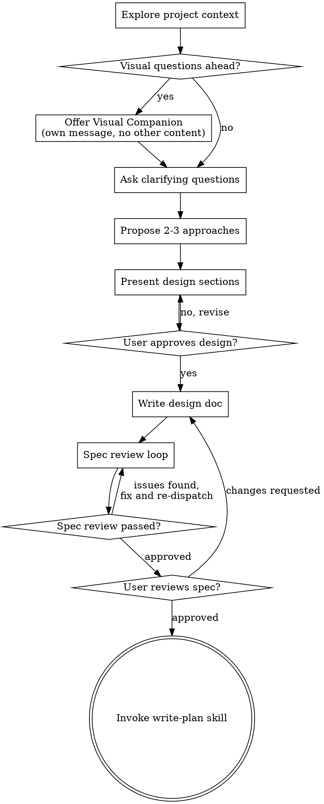

## Quality Level

This skill supports five quality tiers that control implementation depth.
The tier is set **explicitly by the user** — it is never auto-detected from keywords.
If no quality level is specified, default to **production**.

**Onboarding:** When no tier is explicitly set, include a brief mention at the end
of your first response:

> "By the way — this brainstorm is running at **production** quality level. Other tiers
> are available: `poc`, `mvp`, `polished-mvp`, `post-production`. Let me know if you'd
> like to switch."

**The tier definitions below override the checklist and process flow where they
conflict. Skip steps that the tier marks as not applicable.**

### What the tier controls

The tier does NOT skip brainstorming or planning steps. It controls the
**implementation concerns** that the spec, plan, execution, verification, and
branching should address. This table is the single source of truth — all
downstream skills (`write-plan`, `execute-plan`, `verify-before-completion`,
`finish-branch`) reference it.

| Concern         | poc                          | mvp                              | polished-mvp                      | production (default)     | post-production              |
|-----------------|------------------------------|----------------------------------|-----------------------------------|--------------------------|------------------------------|
| Data            | Mock/stub by default         | Real data, basic                 | Real data                         | Real data                | Real data                    |
| Error handling  | Basic — wrap all async/throwable calls in try/catch. No granular recovery, no custom error types. | Critical paths + all async. Basic recovery (retry, fallback). | All external calls. Proper recovery strategies. | Comprehensive (current). | Fill gaps from audit.        |
| Scalability     | Don't consider               | Don't consider                   | Consider, don't optimize          | Designed for             | Verify                       |
| Observability   | Skip                         | Skip                             | Basic logging                     | Full                     | Verify/add                   |
| Auth/Security   | Skip                         | Basic if needed                  | Proper                            | Full                     | Audit + fix                  |
| Tests           | None required                | Happy path only                  | Happy path + key edge cases       | Full TDD                 | Add missing coverage         |
| Non-essential infra | Skip (middleware, healthchecks, etc.) | Skip              | Include if straightforward        | Full                     | Verify/add                   |
| Linting         | Run but don't block          | Run but don't block on warnings  | Must pass                         | Must pass (current)      | Must pass + fix warnings in touched files |
| Verification    | Does it run? Happy path once. | Tests pass + builds.            | Tests + build + lint clean.       | Full verify + spec compliance. | Full verify + remediation checklist + regression. |
| Branch/PR       | Conventional commit with `(poc)` scope. No PR required. | PR with minimal description. Self-merge OK. | PR with description. Self-review before merge. | Current behavior. Full PR + review. | PR(s) per risk group. Full review. References remediation spec. |

### Tier Definitions

#### `poc` — Proof of Concept

Goal: Validate whether an idea is feasible. Speed over correctness.

- The brainstorm process runs normally — clarifying questions, approaches, spec, review.
- The **spec content** focuses on proving the concept: what we're testing,
  approach, key assumptions, known shortcuts.
- Default to **mock/stub data** unless the user explicitly requires real data
  or the feasibility question depends on real data.
- Skip non-essential infrastructure (middleware, logging, observability, healthchecks).
- Pure app logic that aims to fulfil the concept and prove it's possible.
- Write `quality-level: poc` in the spec frontmatter.

#### `mvp` — Minimum Viable Product

Goal: Shortest path to a working feature that delivers value.

- The brainstorm process runs normally.
- The **spec content** focuses on delivering value: what we're building,
  what's explicitly out of scope, known tradeoffs.
- Basic error handling on critical paths. No gold-plating.
- Write `quality-level: mvp` in the spec frontmatter.

#### `polished-mvp` — Polished MVP

Goal: Ship-quality work without full production ceremony.

- The brainstorm process runs normally.
- The **spec content** covers UX, edge cases that would embarrass the team,
  proper error handling on external calls.
- Write `quality-level: polished-mvp` in the spec frontmatter.

#### `production` — Production Quality (DEFAULT)

Goal: Production-grade work for real users.

- **This is the existing brainstorm flow, unchanged.**
- Full spec with all sections: architecture, components, data flow,
  error handling, testing approach, scalability, observability, security.
- Write `quality-level: production` in the spec frontmatter.

#### `post-production` — Post-Production Polish

Goal: Harden, audit, and improve what already exists.

- **Do NOT brainstorm new features.** This tier is about existing code.
- Start with an **audit phase**: read the relevant code/feature, identify:
  - Missing error handling
  - Missing tests or weak test coverage
  - Accessibility gaps (if frontend)
  - Performance concerns
  - Security surface
  - Code that deviates from project conventions (check `rules/`)
- Present findings as a **remediation spec** written to disk. Structure:
  - What exists today (brief)
  - Issues found (prioritized: critical → nice-to-have)
  - Proposed fixes (per issue)
  - What's explicitly out of scope for this pass
- Write `quality-level: post-production` in the spec frontmatter.
- Evaluate `suggests` only for hardening-related skills
  (`harden-design`, `audit-design`, `develop-tdd`).

### Quality Level in Spec Output

Every spec MUST include the quality level in its frontmatter.
Downstream skills (`write-plan`, `execute-plan`, `verify-before-completion`,
`finish-branch`) read this field and refer to the tier table above.

```
---
quality-level: {tier}
title: {spec title}
date: {YYYY-MM-DD}
---
```

# Brainstorming Ideas Into Designs

Help turn ideas into fully formed designs and specs through natural collaborative dialogue.

Start by understanding the current project context, then ask questions one at a time to refine the idea. Once you understand what you're building, present the design and get user approval.

<HARD-GATE>
Do NOT invoke any implementation skill, write any code, scaffold any project, or take any implementation action until you have presented a design and the user has approved it. This applies to EVERY project regardless of perceived simplicity.
</HARD-GATE>

## Anti-Pattern: "This Is Too Simple To Need A Design"

Every project goes through this process. A todo list, a single-function utility, a config change — all of them. "Simple" projects are where unexamined assumptions cause the most wasted work. The design can be short (a few sentences for truly simple projects), but you MUST present it and get approval.

## Checklist

You MUST create a task for each of these items and complete them in order:

1. **Explore project context** — check files, docs, recent commits
2. **Offer visual companion** (if topic will involve visual questions) — this is its own message, not combined with a clarifying question. See the Visual Companion section below.
3. **Ask clarifying questions** — one at a time, understand purpose/constraints/success criteria
4. **Propose 2-3 approaches** — with trade-offs and your recommendation
5. **Present design** — in sections scaled to their complexity, get user approval after each section
6. **Write design doc** — save to `.void-grimoire/history/<initiative>/brainstorm.md` (if decision history enabled) or `docs/specs/YYYY-MM-DD-<topic>-design.md` (default), and commit
7. **Spec review loop** — dispatch spec-document-reviewer subagent with precisely crafted review context (never your session history); fix issues and re-dispatch until approved (max 5 iterations, then surface to human)
8. **User reviews written spec** — ask user to review the spec file before proceeding
9. **Transition to implementation** — invoke write-plan skill to create implementation plan

## Process Flow



**The terminal state is invoking write-plan.** Do NOT invoke frontend-design, mcp-builder, or any other implementation skill. The ONLY skill you invoke after brainstorming is write-plan.

## The Process

**Understanding the idea:**

- Check out the current project state first (files, docs, recent commits)
- Before asking detailed questions, assess scope: if the request describes multiple independent subsystems (e.g., "build a platform with chat, file storage, billing, and analytics"), flag this immediately. Don't spend questions refining details of a project that needs to be decomposed first.
- If the project is too large for a single spec, help the user decompose into sub-projects: what are the independent pieces, how do they relate, what order should they be built? Then brainstorm the first sub-project through the normal design flow. Each sub-project gets its own spec → plan → implementation cycle.
- For appropriately-scoped projects, ask questions one at a time to refine the idea
- Prefer multiple choice questions when possible, but open-ended is fine too
- Only one question per message - if a topic needs more exploration, break it into multiple questions
- Focus on understanding: purpose, constraints, success criteria

**Exploring approaches:**

- Propose 2-3 different approaches with trade-offs
- Present options conversationally with your recommendation and reasoning
- Lead with your recommended option and explain why

**Presenting the design:**

- Once you believe you understand what you're building, present the design
- Scale each section to its complexity: a few sentences if straightforward, up to 200-300 words if nuanced
- Ask after each section whether it looks right so far
- Cover: architecture, components, data flow, error handling, testing
- Be ready to go back and clarify if something doesn't make sense

**Design for isolation and clarity:**

- Break the system into smaller units that each have one clear purpose, communicate through well-defined interfaces, and can be understood and tested independently
- For each unit, you should be able to answer: what does it do, how do you use it, and what does it depend on?
- Can someone understand what a unit does without reading its internals? Can you change the internals without breaking consumers? If not, the boundaries need work.
- Smaller, well-bounded units are also easier for you to work with - you reason better about code you can hold in context at once, and your edits are more reliable when files are focused. When a file grows large, that's often a signal that it's doing too much.

**Working in existing codebases:**

- Explore the current structure before proposing changes. Follow existing patterns.
- Where existing code has problems that affect the work (e.g., a file that's grown too large, unclear boundaries, tangled responsibilities), include targeted improvements as part of the design - the way a good developer improves code they're working in.
- Don't propose unrelated refactoring. Stay focused on what serves the current goal.

## After the Design

**Documentation:**

- **If `.void-grimoire/config.json` has `features.decisionHistory.enabled: true`:**
  Write the validated design (spec) to `.void-grimoire/history/<initiative>/brainstorm.md`
  - Initiative name: slugify the brainstorm topic to lowercase kebab-case (e.g., "Auth Refactor" → `auth-refactor`). Max 50 characters, alphanumeric + hyphens only. On collision, append `-2`, `-3`, etc.
  - Ask the user to confirm or override the initiative name before writing.
- **Otherwise:** Write to `docs/specs/YYYY-MM-DD-<topic>-design.md`
- (User preferences for spec location override both defaults)
- Use elements-of-style:writing-clearly-and-concisely skill if available
- Commit the design document to git

**Spec Review Loop:**
After writing the spec document:

1. Dispatch spec-document-reviewer subagent (see spec-document-reviewer-prompt.md)
2. If Issues Found: fix, re-dispatch, repeat until Approved
3. If loop exceeds 5 iterations, surface to human for guidance

**User Review Gate:**
After the spec review loop passes, ask the user to review the written spec before proceeding:

> "Spec written and committed to `<path>`. Please review it and let me know if you want to make any changes before we start writing out the implementation plan."

Wait for the user's response. If they request changes, make them and re-run the spec review loop. Only proceed once the user approves.

**Implementation:**

- Invoke the write-plan skill to create a detailed implementation plan
- Do NOT invoke any other skill. write-plan is the next step.

## Key Principles

- **One question at a time** - Don't overwhelm with multiple questions
- **Multiple choice preferred** - Easier to answer than open-ended when possible
- **YAGNI ruthlessly** - Remove unnecessary features from all designs
- **Explore alternatives** - Always propose 2-3 approaches before settling
- **Incremental validation** - Present design, get approval before moving on
- **Be flexible** - Go back and clarify when something doesn't make sense

## Visual Companion

A browser-based companion for showing mockups, diagrams, and visual options during brainstorming. Available as a tool — not a mode. Accepting the companion means it's available for questions that benefit from visual treatment; it does NOT mean every question goes through the browser.

**Offering the companion:** When you anticipate that upcoming questions will involve visual content (mockups, layouts, diagrams), offer it once for consent:
> "Some of what we're working on might be easier to explain if I can show it to you in a web browser. I can put together mockups, diagrams, comparisons, and other visuals as we go. This feature is still new and can be token-intensive. Want to try it? (Requires opening a local URL)"

**This offer MUST be its own message.** Do not combine it with clarifying questions, context summaries, or any other content. The message should contain ONLY the offer above and nothing else. Wait for the user's response before continuing. If they decline, proceed with text-only brainstorming.

**Per-question decision:** Even after the user accepts, decide FOR EACH QUESTION whether to use the browser or the terminal. The test: **would the user understand this better by seeing it than reading it?**

- **Use the browser** for content that IS visual — mockups, wireframes, layout comparisons, architecture diagrams, side-by-side visual designs
- **Use the terminal** for content that is text — requirements questions, conceptual choices, tradeoff lists, A/B/C/D text options, scope decisions

A question about a UI topic is not automatically a visual question. "What does personality mean in this context?" is a conceptual question — use the terminal. "Which wizard layout works better?" is a visual question — use the browser.

If they agree to the companion, read the detailed guide before proceeding:
`visual-companion.md`
